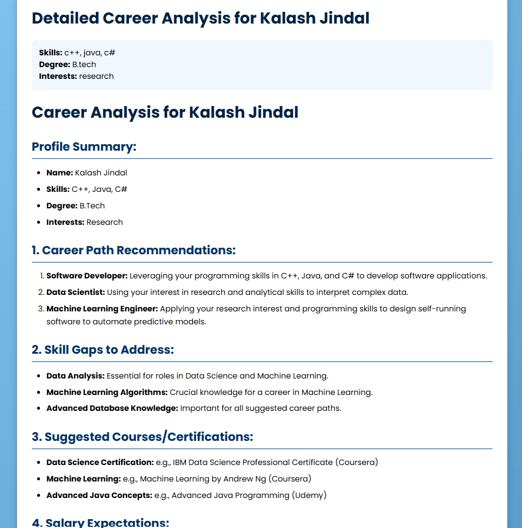
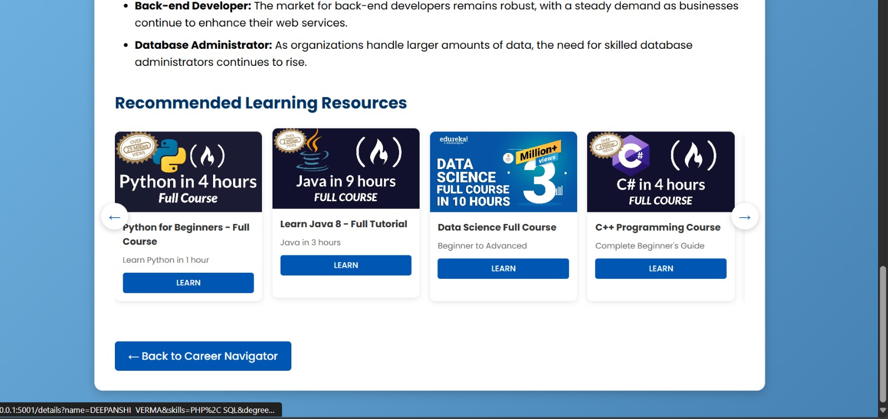

# Lumina_Microsoft_Hackathon
# CareerDisha: Your AI Career Advisor(using Azure Services) 🚀

CareerDisha is an AI-powered career recommendation system that helps users find the best job opportunities based on their skills, interests, and education. It uses **Flask**, **Azure OpenAI API**, and **Pandas** to analyze resumes and suggest relevant career paths.

## Features 🌟
- **Upload Resume (PDF)** – Extracts skills using AI.
- **AI-Powered Career Recommendations** – Matches jobs based on your profile.
- **Detailed Career Analysis** – Skill gap identification & salary insights.
- **Interactive UI** – Simple and user-friendly interface.

## Installation  
1. Clone the Repository  
    ```bash
      git clone https://github.com/yourusername/CareerDisha.git
      cd CareerDisha
2. Set up your virtual environment, and then install the required packages from requiremnets.txt file using the command:
   ```bash
   pip install -r requiremenets.txt
3. Set environment variables (Optional but recommended):
   ```bash
   export ENDPOINT_URL="your_azure_openai_endpoint"
   export DEPLOYMENT_NAME="your_deployment_name"
   export AZURE_OPENAI_API_KEY="your_api_key"
4. Run the application:
   ```bash
   python app.py
5. Open in browser:
   ```bash
    http://localhost:5001
## Usage
CareerDisha helps job seekers and students find the best career paths based on their skills, interests, and education.  

### Real-Life Applications:  
- **Resume-Based Job Matching** – Users can upload their resume, and the AI extracts skills to recommend relevant jobs.  
- **Personalized Career Advice** – AI suggests job roles based on user-provided skills, interests, and degree.  
- **Skill Gap Analysis** – Identifies missing skills and recommends courses/certifications to improve job prospects.  
- **Job Market Insights** – Provides salary expectations, demand trends, and industry recommendations.  
- **Student Career Guidance** – Helps fresh graduates explore career options aligned with their academic background.  
- **Career Transition Support** – Suggests alternate career paths based on transferable skills.  

CareerDisha bridges the gap between job seekers and recruiters, making career planning more effective.  

## Screenshots
### Home Page

### Career Analysis Report

### Career Analysis Full Report




